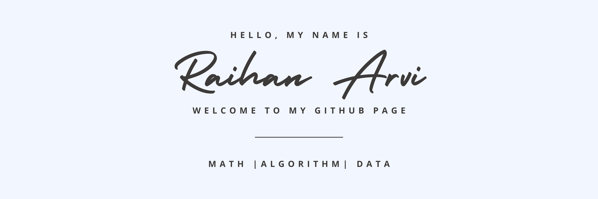

Check out my social medias:
<!-- badges -->

<!-- link to badge icons https://dev.to/envoy_/150-badges-for-github-pnk -->
<!-- https://simpleicons.org/ -->

Hi there, 👋
I am Raihan, a Mathematics undergraduate student @ The University of British Columbia. I am interested in data analysis, machine learning, and statistics. 

## 🖥️ Check out My Projects!
#### ✨ Machine Learning & Quantitative Data Analysis
- [SocialCam: Computer Vision Social Distancing Detector using YOLOv4](https://github.com/RaihanArvi/SocialCam)
- [Predicting The Success of Speed Dating by Common Individual Traits](https://github.com/MunnChai/dsci-100-group-project).
- [Predicting New York AirBnB Listings Reviews Per Month](https://github.com/RaihanArvi/330_hw5)
- MaskAI: Haar Cascade Classifier and CNN-based Mask Usage Detector in Context of COVID-19
- [LaTeX Writing Sample Project](https://github.com/RaihanArvi/LaTeX_Sample)

#### ✨ UBC Bionics
- [GRASP: UBC Bionics EMG and YOLOv8 Controlled Prosthetic Arm](https://github.com/BEARUBC/grasp-py)
- [NERV: Brain-Computer Interface for Controlling Computers based on 2-Class Motor Imagery](https://github.com/BEARUBC/nerv)

#### ✨ Other Personal Projects
- [WiseStock: Stock Portfolio Wealth Management and Analyzer (Java OOP)](https://github.com/RaihanArvi/WiseStock)
- [Batch Windows Installer: Batch Windows Program Installer Automation](https://github.com/RaihanArvi/batch-win-installer)
- [Agrocast: IoT Smart Automatic Irrigation Based on OpenWeatherMap Data](https://github.com/RaihanArvi/Agrocast)

##### Skills:

## 🖥️ Check out My Youtube Page (In-progress)

## 📩 Contact
Here are some ways to contact me:
- Send me an [email.](mailto:rhnarvi@student.ubc.ca)
- Directly through my [personal website.](https://raihanarvi.com)
- Check out my [LinkedIn.](https://www.linkedin.com/in/raihan-arvi/)

<!--
**RaihanArvi/RaihanArvi** is a ✨ _special_ ✨ repository because its `README.md` (this file) appears on your GitHub profile.

Here are some ideas to get you started:

- 🔭 I’m currently working on ...
- 🌱 I’m currently learning ...
- 👯 I’m looking to collaborate on ...
- 🤔 I’m looking for help with ...
- 💬 Ask me about ...
- 📫 How to reach me: ...
- 😄 Pronouns: ...
- ⚡ Fun fact: ...
-->
